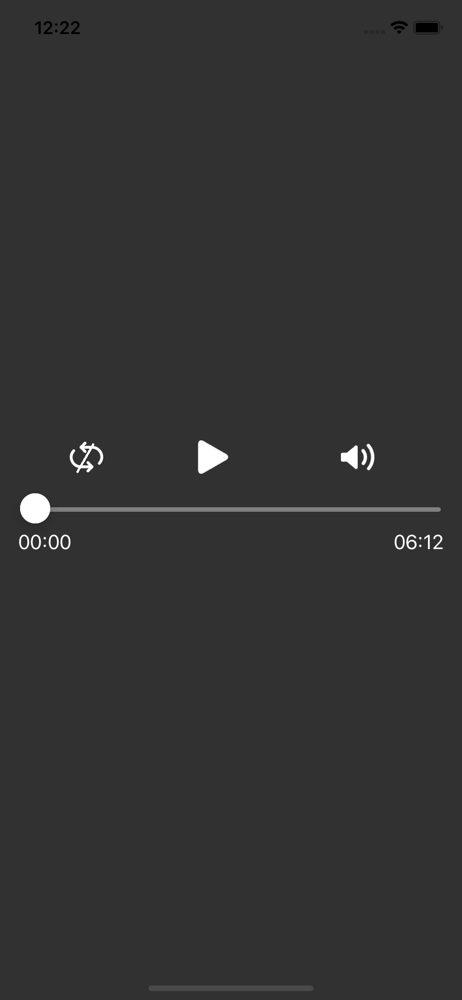
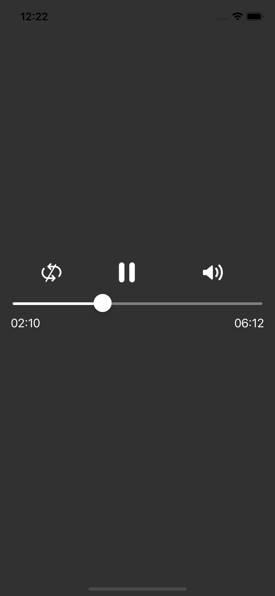
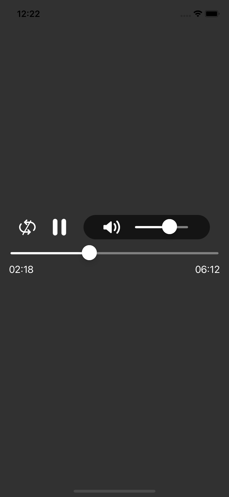

# react-native-simple-audio-player
simple audio player for react native with all required controls

> still in beta version, adding more costomization and documentation soon  :rocket:  :beers:

### Installation

```bash
$ npm i react-native-simple-audio-player --save
```

You'll also need react-native-video (to use controls and audio playback) and slider (for audio seekbar) package, you can install these like,

```bash
$ npm i react-native-video --save
```

```bash
$ npm install @react-native-community/slider --save
```

Import the package

```javascript
import {AudioPlayer} from 'react-native-simple-audio-player';
```

### Basic Usage

This package is still under construction and beta mode, You can still use this by passing your Audio URL to AudioPlayer component. Feel free to drop suggestions and improvements


    

```javascript
import React from 'react';
import {View} from 'react-native';
import {AudioPlayer} from 'react-native-simple-audio-player';

const App = () => {
  return (
    <View
      style={{
        flex: 1,
        backgroundColor: '#313131',
        justifyContent: 'center',
      }}>
      <AudioPlayer
        url={'https://www.soundhelix.com/examples/mp3/SoundHelix-Song-1.mp3'}
      />
    </View>
  );
};

export default App;
```

### Props

---

### `url`

Audio file url.

| Type       | Required |
| ---------- | -------- |
| string     | yes      |

---

> Adding more costomization and documentation soon  :rocket:  :beers:
